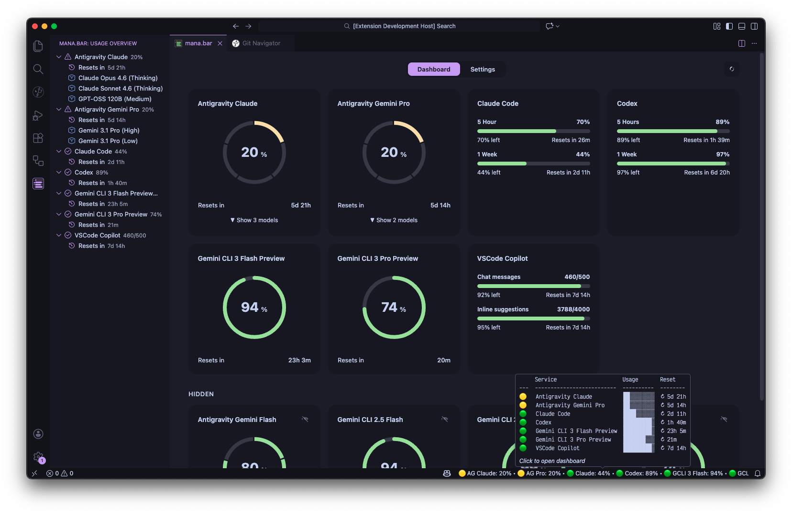
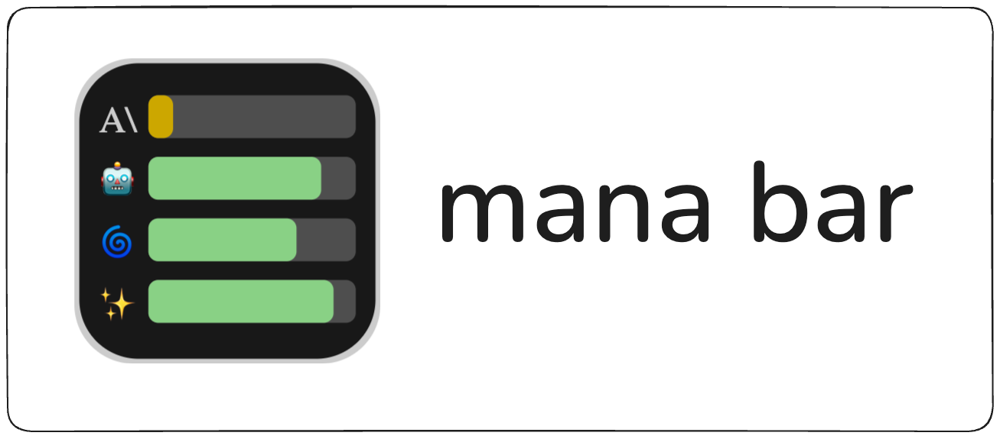
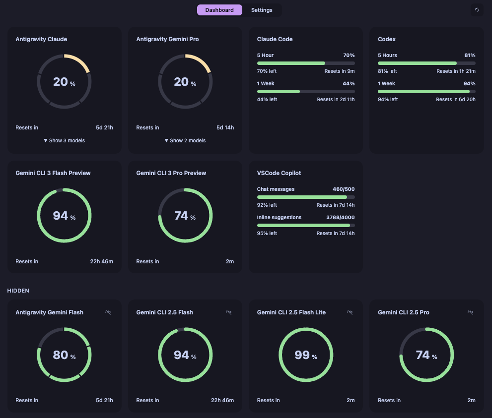
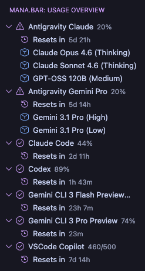
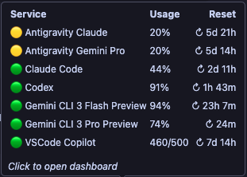
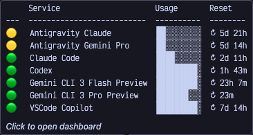
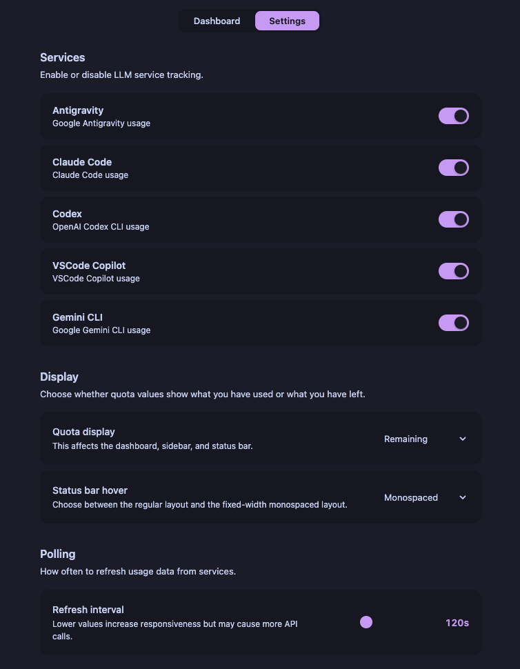

Track your AI coding quota across Claude Code, Codex, VSCode Copilot, Antigravity, and Gemini CLI — all from one place inside VS Code.

## Why?

Most AI coding tools don't make it easy to check how much quota you have left. You end up guessing, or hunting through web dashboards while you're in the middle of a flow. mana.bar puts all your limits in one glance — right inside VS Code.

- Read-only. Never touches your quota.
- Auto-detects credentials you've already set up.
- No accounts, no sign-ups, no telemetry.

## Features

### Dashboard

A full-screen webview with live progress rings, multi-window quota bars, per-model breakdowns, and reset countdowns. Toggle between "used" and "remaining" display modes.

### Sidebar

Compact tree view in the activity bar. One-line usage summary per service, expandable for model-level detail.

### Status Bar

Always-visible usage at the bottom of your editor. Click to open the dashboard.

Hover for a quick summary — choose between a regular table or a monospaced block layout.

| Regular | Monospaced |
|---------|------------|
|  |  |

### Settings

Enable or disable individual services, adjust polling intervals, pick your display mode, and hide services you don't need — all from the settings tab inside the dashboard.

## Supported Services

| Service | Auth | How it works |
|---------|------|--------------|
| **Claude Code** | Anthropic OAuth (keychain / `.credentials.json`) | Reads 5-hour and 7-day utilization from the Anthropic usage API |
| **Codex** | `~/.codex/auth.json` or OS keychain | Spawns `codex app-server` and queries rate limits via JSON-RPC |
| **VSCode Copilot** | VS Code's built-in Copilot session | Reads completions quota from Copilot's API |
| **Antigravity** | Auto-detected in Antigravity IDE | Communicates with the Antigravity extension via VS Code messaging |
| **Gemini CLI** | Google OAuth (keychain / `oauth_creds.json`) | Queries `cloudcode-pa.googleapis.com` quota endpoints |

All providers use read-only endpoints and cache responses for 3 minutes.

## Install

[VS Code Marketplace](https://marketplace.visualstudio.com/items?itemName=binhonglee.mana-bar) · [Open VSX](https://open-vsx.org/extension/binhonglee/mana-bar) · [Cursor](cursor:extension/binhonglee.mana-bar) · [Antigravity](antigravity:extension/binhonglee.mana-bar)

## Configuration

Use the Settings tab inside the dashboard to configure the extension.

| Setting | Default | Description |
|---------|---------|-------------|
| Polling Interval | 120s | How often to refresh usage data (10s–5min) |
| Display Mode | Remaining | Show quota as "used" or "remaining" |
| Tooltip Layout | Regular | Status bar hover style: table or monospaced blocks |
| Services | All Enabled | Enable/disable each provider individually |
| Hidden Services | none | Hide specific services from the sidebar and status bar |

## License

MIT
